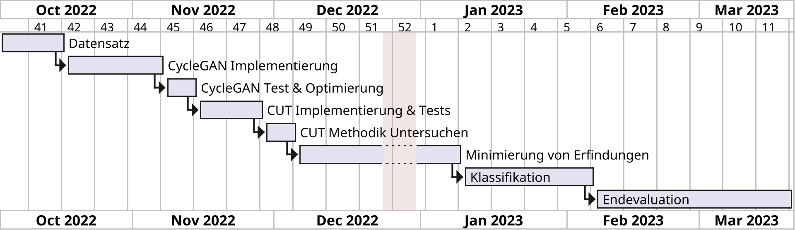

```plantuml
@startgantt
scale 1920 width

printscale weekly
[Datensatz] lasts 2 weeks
[CycleGAN Implementierung] as [CycleGANImpl] lasts 3 weeks
[CycleGAN Test & Optimierung] as [CycleGANOpt] lasts 1 week
[CUT Implementierung & Tests] as [CUT] lasts 2 week
[CUT Methodik Untersuchen] as [CUTMet] lasts 1 week
[Minimierung von Erfindungen] as [MinErf] lasts 4 week
[Klassifikation] as [Klass] lasts 4 week
[Endevaluation] as [End] lasts 6 week

2022-12-24 to 2022-12-30 is closed

Project starts 2022-10-04
[Datensatz] starts 2022-10-04
[CycleGANImpl] starts at [Datensatz]'s end
[CycleGANOpt] starts at [CycleGANImpl]'s end
[CUT] starts at [CycleGANOpt]'s end
[CUTMet] starts at [CUT]'s end
[MinErf] starts at [CUTMet]'s end
[Klass] starts at [MinErf]'s end
[End] starts at [Klass]'s end

@endgantt
```